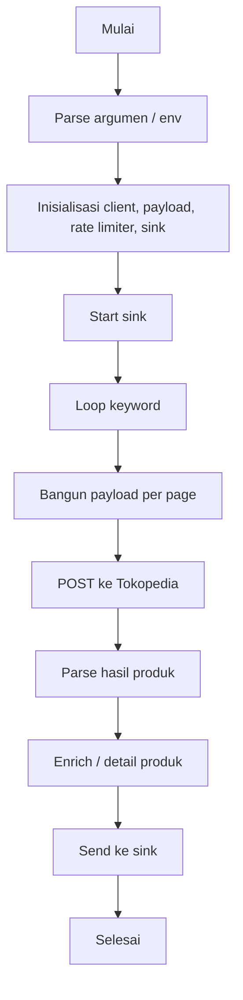

# Tokopedia Crawler

Tokopedia Crawler adalah project crawler asinkron yang mengambil data pencarian dari Tokopedia, memproses produk, lalu mengirim hasil ke sink (Kafka) setelah melalui tahapan enrich/detail parsing.

## Gambaran Umum

Engine crawler ini bekerja dengan alur berikut:

1. Membaca keyword dan jumlah halaman dari argumen atau environment variable.
2. Menginisialisasi client crawler, payload builder, rate limiter, dan sink (Kafka dan/atau JSON).
3. Mengirim request pencarian ke Tokopedia untuk setiap halaman.
4. Mem-parsing hasil pencarian menjadi daftar produk.
5. Melakukan proses detail/enrichment produk.
6. Mengirim hasil ke sink yang sudah dikonfigurasi (Kafka dan/atau JSON file).

## Arsitektur Singkat



## Fitur Utama

- Crawler asinkron berbasis `asyncio`
- Rate limiter untuk mengurangi risiko block request
- Parsing hasil pencarian produk
- Fetcher detail produk dan enrichment lanjutan
- **Dual Output Support**: Kafka dan JSON file secara bersamaan atau terpisah
- **Flexible Output Control**: Pilih output ke Kafka, JSON, atau keduanya
- **Auto Folder Creation**: Folder output dibuat otomatis

## Prasyarat

- Python 3.10+
- pip
- Dependensi yang terdaftar di `requirements.txt`

## Instalasi

Masuk ke folder project lalu buat virtual environment (opsional tapi disarankan):

```bash
cd /home/asyarie/CodeProject/Improvement/tokopedia-crawler
python3 -m venv .venv
source .venv/bin/activate
pip install -r requirements.txt
```

## Konfigurasi

Project membaca konfigurasi dari folder `config/`:

- `config/base.yaml` untuk konfigurasi umum
- `config/dev.yaml` untuk override environment development

Beberapa konfigurasi penting yang digunakan antara lain:

- URL GraphQL Tokopedia
- Header request
- Endpoint Kafka
- Setting PostgreSQL / Elasticsearch

## Menjalankan Aplikasi

### Basic Usage

#### 1. Jalankan dengan keyword lewat argumen

```bash
python -m app.main --keyword "sepatu" --max-page 2
```

#### 2. Jalankan dengan keyword lewat environment variable

Buat file `.env` di root project, lalu isi misalnya:

```bash
CRAWL_KEYWORDS=sepatu,keyboard
CRAWL_MAX_PAGE=1
```

Lalu jalankan:

```bash
python -m app.main
```

### Output Options

Aplikasi mendukung output ke JSON file yang **selalu disimpan ke folder `output/` secara default**, sekaligus atau terpisah dari Kafka:

#### 1. Kafka + JSON Output (Default)

Data akan dikirim ke Kafka **dan** disimpan ke JSON file di folder `output/`:

```bash
python -m app.main --keyword "laptop"
# Output otomatis ke: output/laptop.json
```

Atau dengan explicit filename (tetap disimpan di folder `output/`):

```bash
python -m app.main --keyword "laptop" --json-output data.json
# Output ke: output/data.json
```

#### 2. JSON Only (Skip Kafka)

Data hanya disimpan ke JSON file di folder `output/`, **tidak** dikirim ke Kafka:

```bash
python -m app.main --keyword "laptop" --skip-kafka
# Output ke: output/laptop.json
```

#### 3. Kafka Only (No JSON)

Data hanya dikirim ke Kafka, **tidak** disimpan ke JSON file:

```bash
python -m app.main --keyword "laptop"
# Hanya Kafka, tanpa JSON output
```

#### 4. Custom Filename (dalam folder output)

Filename custom tetap akan disimpan di folder `output/`:

```bash
python -m app.main --keyword "laptop" --json-output 2024_data.json
# Output ke: output/2024_data.json
```

#### 5. Absolute Path (folder di luar output)

Jika perlu absolute path atau folder di luar `output/`:

```bash
python -m app.main --keyword "laptop" --json-output /tmp/results.json
# Output ke: /tmp/results.json
```

#### 6. Multiple Keywords

Jika multiple keywords, output otomatis ke `results.json` di folder `output/`:

```bash
python -m app.main --keyword "laptop" --keyword "mouse" --skip-kafka
# Output ke: output/results.json
```

## Contoh Perintah

```bash
# Crawl 1 keyword, output ke Kafka + JSON (otomatis ke output/laptop.json)
python -m app.main --keyword "laptop" --max-page 1

# Crawl multiple keywords, output JSON only
python -m app.main --keyword "mouse" --keyword "keyboard" --max-page 2 --skip-kafka

# Custom JSON filename (tetap disimpan di output/)
python -m app.main --keyword "laptop" --json-output laptop_2024.json
# Output ke: output/laptop_2024.json

# Kafka only (no JSON)
python -m app.main --keyword "phone" --max-page 1

# Multiple keywords dengan custom filename
python -m app.main --keyword "laptop" --keyword "monitor" --json-output multi_results.json --skip-kafka
# Output ke: output/multi_results.json

# Absolute path (di luar folder output/)
python -m app.main --keyword "iphone" --json-output /home/user/data/iphone.json --skip-kafka
# Output ke: /home/user/data/iphone.json
```

## Available Flags

```bash
python -m app.main --help

optional arguments:
  --keyword KEYWORD              Keyword untuk dicari (bisa multiple)
  --max-page MAX_PAGE           Jumlah halaman yang akan dicrawl (default: 1)
  --json-output PATH            Output JSON filename/path
                                - Jika hanya filename: disimpan di output/
                                - Jika absolute path: disimpan ke path tersebut
                                - Default (no flag): output/{keyword}.json
  --skip-kafka                  Disable Kafka output (hanya JSON)
  --enable-kafka                Enable Kafka output (default: True)
```

## Struktur Folder Penting

```text
app/
  crawler/      # engine crawler, client, payload, rate limiter
  parser/       # parser dan enricher produk
  producer/     # client producer Kafka
  consumer/     # consumer sink (Kafka, PostgreSQL, Elasticsearch, JSON)
  services/     # service orchestrator output dan sink
config/         # konfigurasi YAML
output/         # folder output JSON (dibuat otomatis)
```

## JSON Output Format

Jika menggunakan `--json-output`, data akan disimpan dalam format JSON array:

```json
[
  {
    "pic": "asyarie",
    "data": {
      "id": "...",
      "name": "Laptop Gaming ASUS",
      "price": 12999000,
      "rating": 4.8,
      "shop_name": "ASUS Official Store",
      "...": "..."
    }
  },
  {
    "pic": "asyarie",
    "data": {
      "id": "...",
      "name": "Laptop Lenovo ThinkPad",
      "price": 9999000,
      "rating": 4.7,
      "shop_name": "Lenovo Store",
      "...": "..."
    }
  }
]
```

## Catatan

Pastikan service yang dibutuhkan sudah tersedia sesuai konfigurasi:
- **Kafka**: Diperlukan jika tidak menggunakan `--skip-kafka`
- **JSON File**: Default disimpan ke folder `output/` (folder dibuat otomatis)
  - Filename tanpa path → disimpan di `output/`
  - Absolute path → disimpan sesuai path yang diberikan
- **Output Behavior**: 
  - Tanpa flag `--json-output` → otomatis ke `output/{keyword}.json`
  - Multiple keywords tanpa flag → otomatis ke `output/results.json`
- Aplikasi dapat mengirimkan hasil ke Kafka, JSON file, atau keduanya sesuai flag yang digunakan
